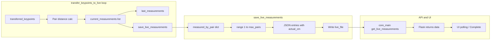

# Measurement-to-UI Data Pipeline Debug Plan

## Problem summary

- **Observed:** CV overlay shows correct non-zero live measurements; Operator Panel shows 0.00 and no QC status update.
- **Scope:** Fix only internal propagation in Python (integration.py, measurement_worker.py). No changes to UI, API contract, JSON schema, Electron IPC, or database.

## Data flow (current)

## Root causes identified

1. **Write vs read path mismatch**
  [integration.py](python-core/integration.py) line 2583 hardcodes `results_dir = 'measurement_results'` (relative to CWD). The worker never passes config `results_path` into the measurer. [core_main.py](python-core/core_main.py) uses `RESULTS_PATH = PROJECT_ROOT/storage/measurement_results` as the primary path and `PROJECT_ROOT/measurement_results` as alt (lines 913–925). Config written at start (line 794) sets `results_path` to `RESULTS_PATH` (storage). So the worker writes to `CWD/measurement_results/` while the API prefers `RESULTS_PATH`; if both files exist, mtime decides. Writing to the same path the API prefers removes ambiguity and ensures the panel reads the live file.
2. **Fallback 0.0 overwriting valid values**
  In `save_live_measurements()`, for any `pair_num` not in `measured_by_pair` this frame we emit `real_distance = 0.0` (lines 2628–2633). If a frame temporarily misses some pairs (e.g. keypoint drop), we can overwrite previously valid values with 0.0. The user requirement: "Ensure that skipped or invalid keypoint pairs do NOT overwrite valid measurements with fallback 0.0 entries" and "measured_by_pair lookup dictionary preserves real values before fallback injection."
3. **No diagnostics**
  There is no logging of: which path is written, pair_num vs calculated distance vs spec_code, or final payload. This makes it hard to confirm propagation and path alignment.

## Implementation plan

### 1. Use config `results_path` for writing (path consistency)

- **measurement_worker.py**  
After loading config and resolving `results_path` (already done), set `measurer.results_path = results_path` (absolute) so the CV engine writes where the API expects. Add one log line: e.g. `[LIVE] Writing live_measurements.json to: <results_path>` so the path is visible in logs.
- **integration.py**  
In `save_live_measurements()` (around 2582–2584):
  - Replace hardcoded `results_dir = 'measurement_results'` with:
    - If `getattr(self, 'results_path', None)` is set, use it as the directory (already absolute).
    - Else fallback to `'measurement_results'` (current behavior).
  - Call `os.makedirs(results_dir, exist_ok=True)` (results_dir may now be an absolute path).
  - Build `live_file = os.path.join(results_dir, 'live_measurements.json')` so the file is written under the config path (i.e. `RESULTS_PATH`) when the worker sets `results_path`.

This ensures the Flask route `get_live_measurements()` reads the same file the worker writes (primary path = RESULTS_PATH).

### 2. Preserve valid measurements (no overwrite by fallback 0.0)

- **integration.py** in `save_live_measurements()`:
  - After building `measured_by_pair` from the current frame’s `measurements` (existing loop), add a merge step:
    - Iterate over `getattr(self, 'last_measurements', [])`.
    - For each tuple `(pair_num, real_distance, ...)` where `real_distance > 0` and `pair_num` is **not** already in `measured_by_pair`, set `measured_by_pair[pair_num] = { 'real_distance': real_distance, 'pixel_distance': ..., 'qc_passed': ..., 'is_fallback': True }` (use existing tuple fields; use 0 for pixel_distance if not stored, and qc_passed from tuple or False).
  - This way, gaps in the current frame are filled from the last valid frame instead of emitting 0.0, and "measured_by_pair preserves real values before fallback injection" is satisfied.
- **Defensive check:** When building the entry for a pair that is in `measured_by_pair`, do not replace a positive `real_distance` with 0.0 (current code already uses `m['real_distance']` for entries in `measured_by_pair`; the merge above ensures we don’t add 0.0 for a pair we had valid data for in `last_measurements`).

### 3. Diagnostic logging (no schema/API change)

- **integration.py** in `save_live_measurements()`:
  - Before writing the file: log the **absolute path** of `live_file` (e.g. resolve with `os.path.abspath(live_file)` if not already absolute).
  - Once per call (or every Nth call to avoid log flood, e.g. modulo 30): for each `pair_num` in the output, log one line: `pair_num`, `real_distance` (or `actual_cm`), `spec_code` (or "none"), and whether the value came from current frame (`pair_num in measured_by_pair` before merge) or from last_measurements/fallback. Optionally log a short summary of `measurement_data['measurements']` (e.g. first 3 entries’ `id`, `spec_code`, `actual_cm`) so the final JSON payload is verifiable.
- **integration.py** in `transfer_keypoints_to_live()`:
  - When appending to `current_measurements` (calibrated branch, ~2873): no need to log every frame. Optionally, every 20–30 frames when `headless and current_measurements`, log once: number of pairs and a single sample `(pair_num, real_distance, ...)` to confirm non-zero values are being collected before `save_live_measurements(current_measurements)`.

Logging should go to the same place as other worker output (e.g. print → worker_logger so it appears in measurement.log). No new log files required.

### 4. Verify API and worker read/write the same path

- **core_main.py** `get_live_measurements()`: No code change. It already prefers `RESULTS_PATH` then `alt_live_file` and picks by existence/mtime. Once the worker writes to `RESULTS_PATH` via `results_path`, the API will read that file.
- **measurement_worker.py**: After setting `measurer.results_path = results_path`, add a single log that prints the path where the engine will write (e.g. `os.path.join(results_path, 'live_measurements.json')`) so it can be compared to API logs if needed.

### 5. Optional: ensure `last_measurements` is always set before save (no behavioral change to UI)

- In `transfer_keypoints_to_live()`, we already set `self.last_measurements = current_measurements` when `current_measurements` is non-empty (lines 2881–2882), and only call `save_live_measurements(current_measurements)` when `headless and current_measurements`. So `last_measurements` is updated before each save. No change required; the merge in step 2 uses `last_measurements` to fill gaps in the **current** frame’s `measured_by_pair` so we never emit 0.0 for a pair we had a valid value for on the previous frame.

## Files to touch

| File                                                                   | Changes                                                                                                                                                                                                                                                                                                                                                                         |
| ---------------------------------------------------------------------- | ------------------------------------------------------------------------------------------------------------------------------------------------------------------------------------------------------------------------------------------------------------------------------------------------------------------------------------------------------------------------------- |
| [python-core/measurement_worker.py](python-core/measurement_worker.py) | Set `measurer.results_path = results_path`; log the path where live_measurements.json will be written.                                                                                                                                                                                                                                                                          |
| [python-core/integration.py](python-core/integration.py)               | (1) Use `self.results_path` in `save_live_measurements()` for output directory; (2) merge `last_measurements` into `measured_by_pair` so valid values are not overwritten by 0.0; (3) add diagnostic logging (live_file path, per-pair summary, optional payload snippet). Optionally in `transfer_keypoints_to_live()` add a low-frequency log of current_measurements sample. |

## What is not changed

- UI components, API response shape, JSON schema of `live_measurements.json`, Electron IPC, and database/GraphQL logic remain unchanged. Only the internal Python path choice, preservation of valid values, and logging are modified.

## Verification

- Run a measurement (front and back); confirm in `runtime/logs/measurement.log` (or equivalent):
  - The written path is under `storage/measurement_results` (same as RESULTS_PATH).
  - Per-pair lines show non-zero `real_distance` / `actual_cm` and correct `spec_code` where applicable.
  - No fallback 0.0 for pairs that have a value in `last_measurements`.
- Confirm Operator Panel Result column and QC status update with non-zero values for both Front and Back.

